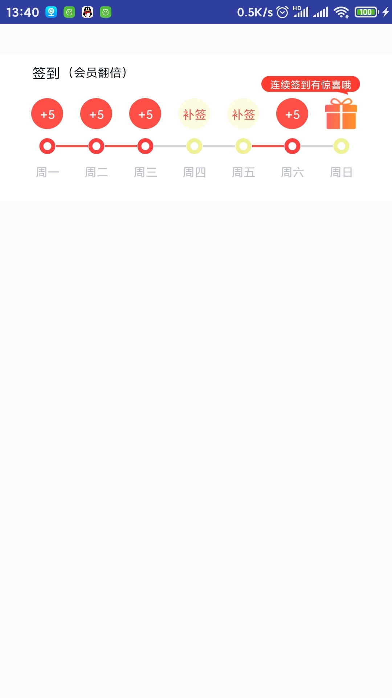
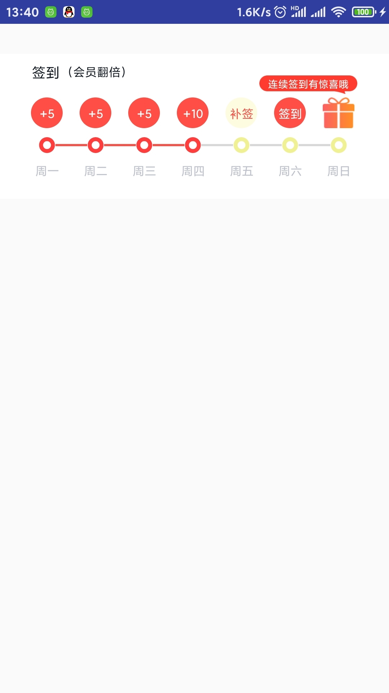
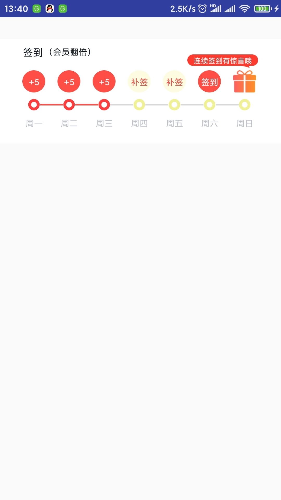

# 打卡签到view
> 一个自定义签到View，从网上找了个做了修改，以适应自己项目

- [博----------客](https://www.jianshu.com/u/aba4338c7578/)

实现签到规则如下：
1、周一-周四连续签到，周四奖励翻倍，连续签到7天周日翻倍。
2、连续签到记录在第8天开始时将清零重新计算。
3、如果中断签到，连续签到记录也将清零。
4、其中bean，activity 控制view的显示 逻辑有点乱 仔细看，根据自己需求更改
实现过程：
### 预览效果图

### 如何使用
-7天里[0,0,0,1,1,0,0]  是否签到0代表当天未签到，1代表当天已签到 (周四周五已签到)

###具体内容看代码 注释详细
